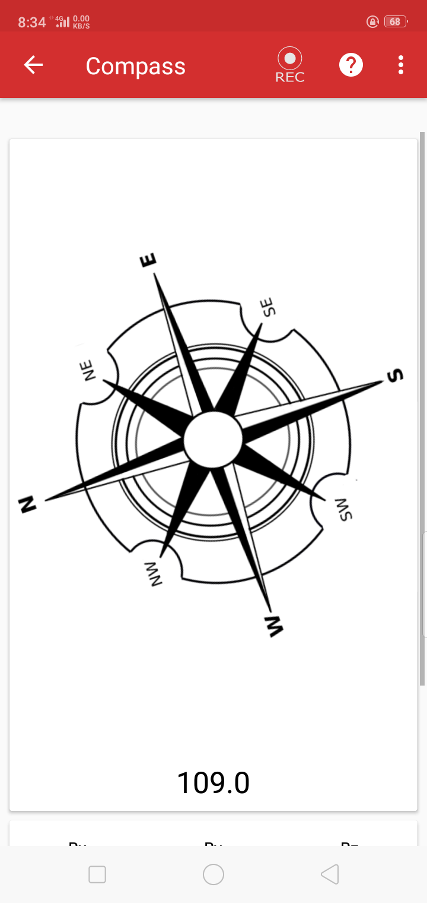
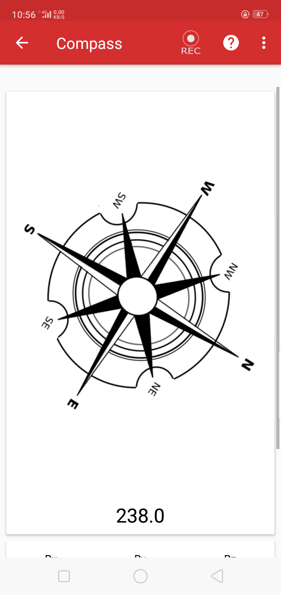

# pslab-Compass
PSLab Documentation and Experiments https://docs.pslab.io

a) I proposed an experiment to find how mobile compasses work without actually using magnets within the phone.

b) Observations :
1) For the given experiment we need a coiled wire connected to a battery. The battery should be turn  switch on so that current starts flowing through the circuit.

2) Now on placing the PSLab compass near the coiled wire we notice no deflection in the compass. But on taking a normal magnetic compass we do see deflection.
3) As we shift the normal magnetic compass around the coiled wire the compass deflects in a different manner. But this shows no effect on the PSLab compass.
4) Thus through this experiment it shows that flowing charges (current) do produce a magnetic field which do interact with the magnet inside a normal but that show no effect on the PSLab compass.

c) Conclusion :

5) This thus shows that the PSLab compass does not use magnets but in turn uses GPS and other sensors (basically digital means) to provide direction in terms of North,South,East and West. It further analyses the GPS and Sensor readings and then using this information aligns the compass needles according to our phones alignment and general position.
6) This is also one of the better (and probably only way) ways to integrate a compass in a digital device as an actual compass may hinder with the phone other electrical components causing them to malfunction.
d) Screenshots provided below :

1)Without Current:

2)With Current:

e) As you can see there is no deflection caused by the flow of charges in the circuit, i.e, the induced magnetic field does interact with the PSLab compass.

