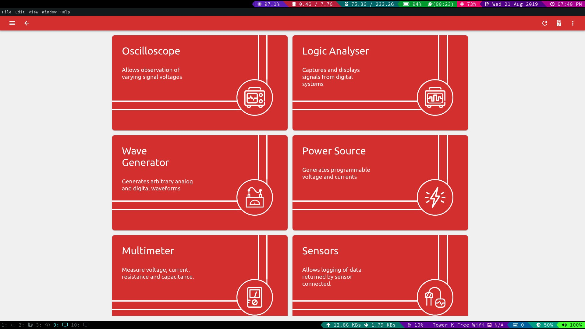

# Desktop Application

Download the Stable version for various platforms here https://github.com/fossasia/pslab-desktop/tree/install 🌐

## How to install the Desktop Application (latest Development version)

- Windows  _(currently there is no official distribution for latest dev pslab desktop application in order to run the application you need to do the following things)_:
    
    1. Go to official Repository at https://github.com/fossasia/pslab-desktop 
    2. Download as a zip or clone in the next step
        1. Click on clone the download it as zip
        2.  Extract the zip file
    3. Open terminal and type 
        ```
        git clone https://github.com/fossasia/pslab-desktop.git
        ```
    4. Go inside the project folder
    5. Open **Command Prompt** or **Powershell**
    6. Write the following commands chronologically _(Make sure you have node.js installed if not go [here](https://nodejs.org/))_
    
        ```
        npm install
        ```
        _Wait for it to finish_
        ```
        npm start
        ```

    7. PSLab desktop should open in front of you 😇
- Mac
    1. The Procedure should be the same but instead of `5. Open Command Prompt or Powershell` Open the terminal
- Linux _(for Linux installation, go to https://github.com/fossasia/pslab-desktop. There you can find the linux installation documention in detail)_
## How to use the Desktop App


- To use any feature of the PSLab Desktop application first follow
    these 2 steps:
    1.  Connect PSLab board with your Desktop using USB cable
    2.  Open [PSLab Desktop application](https://github.com/fossasia/pslab-desktop)

You will be presented with a home screen like this.



Click on the instrument you would like to use.
