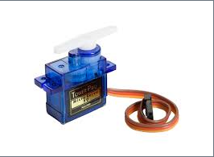
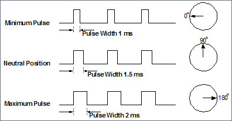

Servo Motor Control
---

* The rotation angle of limited range servo motors can be controlled via Pulsed Width Modulated(PWM) input waveforms.  The angle of rotation is a function of the duty cycle of the PWM waveform as shown in the following figure

* SQR1 to SQR4 outputs are capable of inpedendent frequency and duty cycle control, and these can be used to independently control up to four servo motors.
* Since high torque servos require high currents which the USB port may not be able to provide, they may need to powered with a separate power source.
* In such cases the ground connector (Black/-Ve terminal) must also be connected with any of the GND pins on the vLabtool ( so that the control signal from SQR has a return path ).

