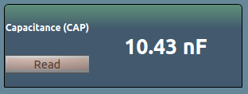

Capacitors 101
---
### Introduction to capacitors
#### Make your own parallel plate capacitor

* Stick a square piece of aluminium tape on either side of a piece of butter paper. Ensure that the two plates do not touch each other along the edges, and are separated by the butter paper.

* Connect one plate to SEN, and the other to GND, and measure the capacitance.

* Now cut this capacitor along the center, such that the area is reduced by half, and measure capacitance again.

#### Study how capacitors behave in combination 

* Measure the values of the capacitors by individually connecting them between CAP and GND, and note these.

#### In Parallel

* Connect the two capacitors in parallel as shown below, and observe the combined capacitance. Ctotal = C1+C2.

#### In Series

* Now connect them in series, and measure the net capacitance

#### screenshot

