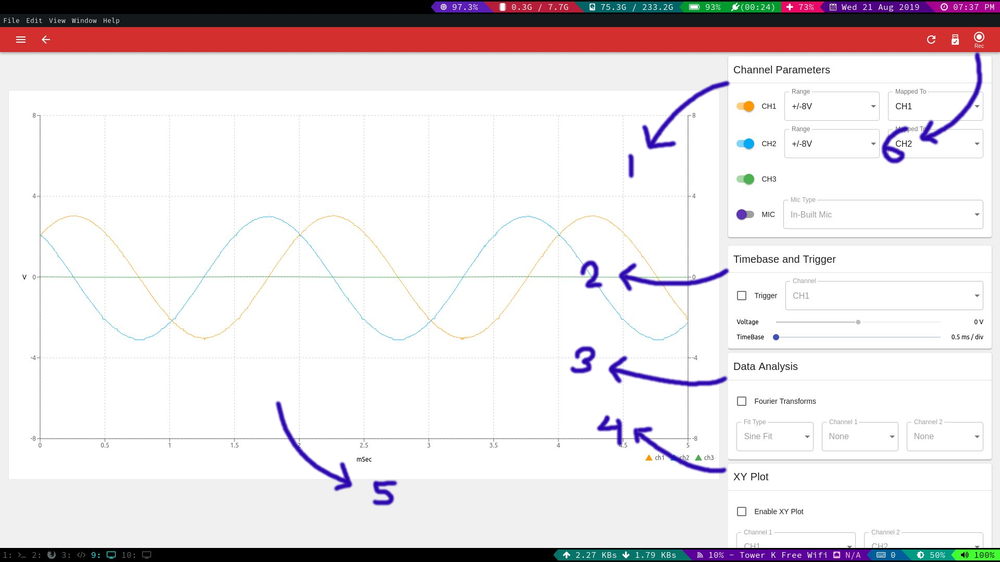

# Oscilloscope

## What Is An Oscilloscope

An instrument used to measure voltage changes over a period of time in
real time.

<table>
    <tr> 
        <td></td>
        <td></td>
    </tr>
</table>

## How To Use It

1.  Connect SI1 and SI2 pins on PSLab board to CH1 and CH2 pins
    respectively for Analog mode or connect SQ1,SQ2,SQ3 pins to CH1,
    CH2, CH3 pins respectively for Digital mode.
2.  Go to Wave Generator instrument in the PSLab Android application.
3.  Select either Digital or Analog mode.
4.  Set desired frequency, phase and duty(in case of Digital mode)
    values for Wave1 and Wave2 (Analog mode) or SQ1,SQ2,SQ3 (Digital
    mode).
5.  Exit from Wave Generator instrument and got to Oscilloscope
    instrument in PSLab Android application.
6.  Select either or all from the CH1, CH2, CH3 checkbox to see waves
    generated at each channel.
7.  Change timebase of the waves from the Trigger and Timebase section
    on the left control panel.
8.  Plot waves against each other from the XY-Plot section on the left
    control panel.
9.  View results of Fourier transform or curve fitting from the Data
    Analysis section on the left control panel.
10. Use in built microphone of the smartphone as input select IN-BUILT
    MIC option on the bottom panel on the main screen.
11. Use record button to record currently generated waves and store
    the data in a CSV file and play it back at will.

In the desktop app you will see something like this:

1.  Options used to select the active channels and the range of
    measurement.
2.  Timebase adjustments and trigger options.
3.  Fourier analysis and sin/squre fitting options.
4.  XY plotting settings.
5.  Graph area.
6.  Record button.

____________
## Experiment: Measure Sound

### Goal of the experiment: To measure the intensity of sound produced.

### Materials required
* Android Phone
* [PSLab Android App](https://play.google.com/store/apps/details?id=io.pslab&hl=en_US)

### Procedure
* Open PSLab Android app 

* Select Oscilloscope option
* On opening the app,you will see various options:

  - Channel Parameters
  - Timebase and Trigger
  - Data Analysis
  - XY Plot

* Select **Channel Parameter** and select the **In-Built MIC** option.

* Now, go to **Data Analysis** option and select **Fourier Transforms**.
* After doing all the above steps, try recording a sound using the in built record option.

### Observations
On observing the recorded sound from the logs, it is noticed that there is a large displacement in the graph for a loud shrill sound and small displacement for a faint sound of low pitch.

*  High Pitch

* Low Pitch

### Conclusion
From the above experiment, I conclude that the PSLab app Oscilloscope can be used to measure the intensity of sound.
